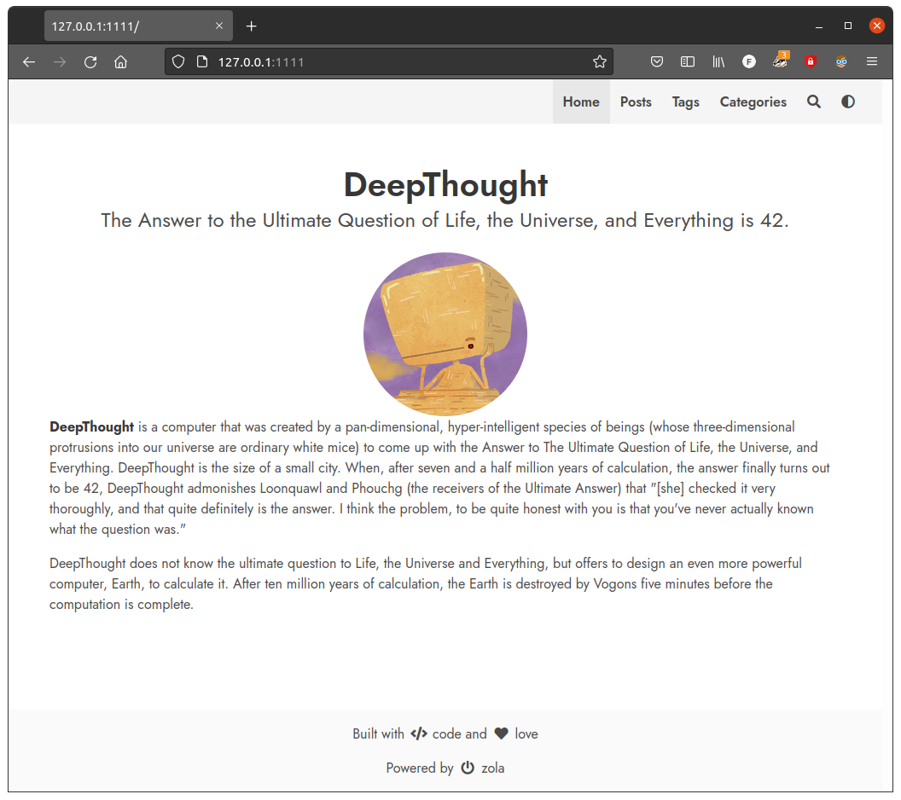

+++
title="Starting a blog with Zola"
date=2021-11-10

[taxonomies]
categories = ["Project"]
tags = ["zola", "blog", "markdown", "rust"]
+++

A blog is a great way to reflect on thoughts and to get in touch with
like-minded people. Maybe you think about starting a blog or want to change
your writing workflow. Choosing a framework for blogging can be a hard task.
There are plenty of options and each has it's strengths and flaws. This is a
short excerpt of my story using a framework called Zola.

<!-- more -->

# Static site generation

It has been a while that I want to start a blog about all kinds of things and
now finally you can read my first published post. The probably most used
platform for small websites is WordPress. After having gained some experience
with it I am tempted to try a different approach: static site generation. The
main difference here is, that you basically write your content on a local
machine, then you run a program which generates the website from that content.
When the content lives in a repo on GitHub, continuous integration and [GitHub
Pages](https://pages.github.com/) simplify the publishing workflow of your
website.

 

|                         | WordPress                  | Static site generator |
|                         |                            |                       |
| **Setup**               | Very easy on WordPress.com | More work necessary   |
| **Editing**             | Through web interface      | Markdown files        |
| **Server-Capabilities** | Database and PHP necessary | Only static files     |

The free hosting on GitHub Pages without advertisement and writing content in
Markdown is a big plus for me. The most established framework is
[Jekyll](https://jekyllrb.com/). Since I am curious on what existed in the
[Rust](https://www.rust-lang.org/) world and found two projects:
[Coblat](https://cobalt-org.github.io/) and [Zola](https://www.getzola.org/).
To have a good-looking website right from the beginning it is nice to have some
predefined theming options available. I couldn't find a way to easily theme
Cobalt, so I choose Zola.  There are plenty of options in their
[showcase](https://www.getzola.org/themes/).

# Zola with DeepThought

After having [Zola
installed](https://www.getzola.org/documentation/getting-started/installation/)
it is used through its CLI. Start a new Zola project in a directory called
`myblog` by running:

    zola init myblog

Zola will ask you some questions and depending on the answers it will populate
the configuration file `conifg.toml`. If you don't know what to choose, you can
go with the defaults by just pressing enter. I recommend using git for version
control, so we have to initialize a repository:

    cd myblog
    git init

To use a theme we have to clone it inside the `themes` directory. I will use
the *DeepThought* theme. *(note that `git submodule` requires the parent to be
a git directory.)*

    cd themes
    git submodule add https://github.com/RatanShreshtha/DeepThought
    cd ..  # Back in myblog directory

To get started we have to adjust our `config.toml`, which is located in
`myblog`. In the Zola docs you will find [general
information](https://www.getzola.org/documentation/getting-started/configuration/)
about the configuration. Our theme requires some extra configuration which is
documented [here](https://deepthought-theme.netlify.app/docs/config-options/).
We need to make the following changes:
* Add theme:

      theme = "DeepThought"

* Add taxonomies ([more
  info](https://www.getzola.org/documentation/content/taxonomies/))

      taxonomies = [
        { name = "categories", feed = true, paginate_by = 10 },
        { name = "tags", fees = true, paginate_by = 10 },
      ]

* Add a minimal amount of configuration to the extras section to make the
  website work with our theme. Put this code block after `[extras]`:

      navbar_items = [
          { code = "en", nav_items = [
              { url = "$BASE_URL/", name = "Home" },
              { url = "$BASE_URL/posts", name = "Posts" },
              { url = "$BASE_URL/tags", name = "Tags" },
              { url = "$BASE_URL/categories", name = "Categories" },
          ] },
      ]

      [extra.author]
      name = "DeepThought"
      avatar = "/images/avatar.png"

      [extra.social]

The final `config.toml` should look similar to [this](config.toml) (ordering
can matter).

Now we need to add some content:

    # in myblog directory
    mkdir content/posts
    cp themes/DeepThought/content/_index.md content/
    cp themes/DeepThought/content/posts/post-0.md content/posts/
    cp themes/DeepThought/content/posts/_index.md content/posts/

Now we are done and can serve our website:

    zola serve

Open the browser on the address specified by the output of the command
(something like <http://127.0.0.1:1111> and you should see this:

Congratulations! Feel free to adjust your configuration and add some more
content. You can use `content/posts/post-0.md` as a starting point. The [Zola
Docs](https://www.getzola.org/documentation/) contain a lot of useful
information. Enjoy!
